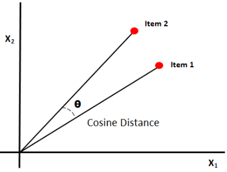

## Overview  
1. The web app is built using React.js for the front-end and python's  flask for the back-end.
2. It enable user to search and go through a huge dataset of movies fetched from IMDB top 1000 movies huge dataset which includes multiple genre, language, multinational cast etc.
3. The web app actively allows users to explore personalized movie recommendations, suggesting the top 10 films based on their input of movie. 

## Snippets of the Web App

1. Homepage


2. Fetching Similar Movie Name


3. Fetching Recommended Movie Name


4. API Testing with Postman


## Backend


1. Utilizes scikit-learn's TfidfVectorizer for TF-IDF-based feature matrix generation from movie overviews, considering word unigrams, bigrams, and trigrams, while excluding common English stop words.
Cosine Similarity:

2. Calculates cosine similarity between movie overviews using the TF-IDF matrix, achieved through scikit-learn's linear_kernel function.
Recommendation Function:

    Cosine Similarity

    

3. Implements a content-based recommendation system, accepting a movie title as input, checking its presence in the dataset, and returning a list of recommended movies based on cosine similarity.

4. Flask API Endpoints:

   Defines Flask endpoints, including /api/movies for all movies, /api/similarity/<name> for movie recommendations, /api/similar_names/<partial_name> for similar movie names, and / for serving the index.html file.
 
5. CORS (Cross-Origin Resource Sharing):

   Incorporates the CORS extension in Flask to facilitate cross-origin resource sharing, enabling frontend requests from different origins to the Flask API.

6. Error Handling:

   Utilizes the not_found function to handle 404 errors by serving the index.html file.


## Frontend

1. React App Structure:
    
    Developed a React application to interface with the Flask backend.
    Implemented asynchronous JavaScript, utilizing the fetch API to retrieve recommendation data and search results from the backend.

2. Search Functionality:

    Implemented a search bar in the React app, allowing users to input partial movie names.
    Used the search bar to make requests to the backend **/api/similar_names/<partial_name>** endpoint for movies with similar names.

3. Recommendation Functionality:

    Integrated a recommendation feature within the React app, enabling users to receive movie suggestions.
    Implemented a mechanism to send requests to the backend's **/api/similarity/<movie_title>** endpoint, using movie titles for generating recommendations based on content similarity.

4. Poster Image Fetching:

    Integrated TMDB (The Movie Database) API to fetch poster images for the recommended movies.
    Dynamically displayed poster images alongside the corresponding movie recommendations.


## Installation 
1. Clone or download this repository to your local machine.
2.  Go to backend directory && install all the libraries mentioned in the [requirements.txt] 
    ```shell
    $ pip install -r requirements.txt
    ```
 3. Then run the flask server by 
    ```shell
    $ python app.py
    ```
4. Go to the frontend directory by opening a new terminal and install the node modules and build the project.
    ```shell
    $ cd frontend
    $ npm install
    ```
5. Copy the .env.sample file to create a .env file and add your TMDB API key. Structue is  Below

    ```
    cp .env.sample .env

    VITE_TMDB_API_KEY= 'YOUR API KEY GOES HERE'
    ```

6.  Then build the project by
    ```shell
    $ npm run dev
    ```
